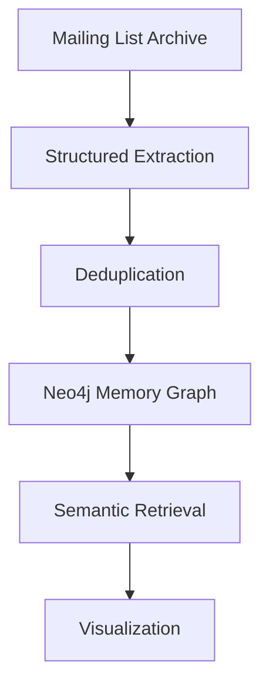
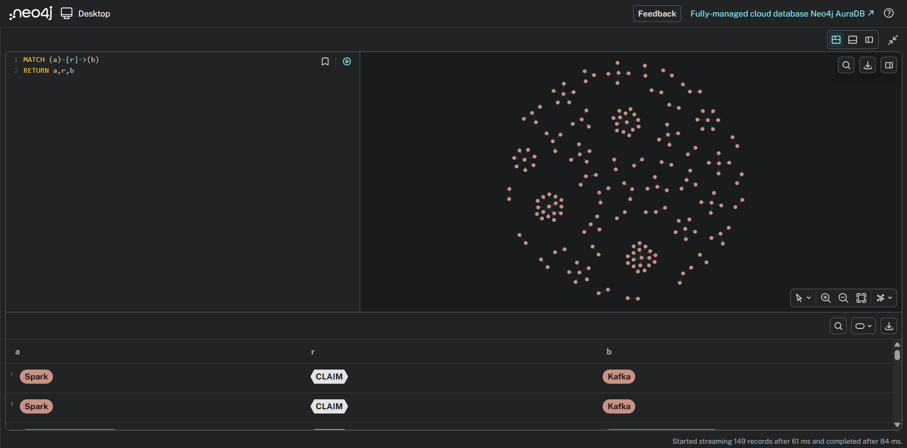

# Grounded Organizational Memory Graph


A system for transforming **unstructured organizational communication into a structured memory graph** with evidence grounding, deduplication, semantic retrieval, and visualization.

---

# Project Overview

Organizations generate large volumes of knowledge through internal communication such as emails, chat messages, and issue trackers. However, this knowledge is often scattered across systems and difficult to retrieve.

This project builds a **Grounded Organizational Memory Graph** that:

* Extracts entities and claims from raw communication
* Grounds every claim with verifiable evidence
* Deduplicates repeated information
* Stores knowledge in a graph database
* Enables semantic retrieval and visualization

---

# System Architecture



Pipeline stages:

1. Dataset ingestion
2. Structured extraction
3. Deduplication and canonicalization
4. Memory graph construction
5. Retrieval and grounding
6. Visualization

---

# Dataset

Dataset used: **Apache Spark Developer Mailing List**

Source:

https://mail-archives.apache.org/mod_mbox/spark-dev/

Each email contains:

* Sender
* Timestamp
* Message content
* Thread metadata

The dataset is parsed using Python’s **mailbox module**.

---

# Ontology Design

The ontology defines entity and relationship types used in the memory graph.

## Entity Types

* Person
* Project
* Technology
* Decision
* Issue

## Relationship Types

* PROPOSED
* USES
* AFFECTS
* DISCUSSES

Example claim:

```
Spark → USES → Kafka
```

---

# Extraction Contract

The extraction system converts raw messages into structured entities and claims.

Example extraction output:

```json
{
  "subject": "Spark",
  "relation": "USES",
  "object": "Kafka",
  "evidence": "We should migrate Spark streaming to Kafka.",
  "timestamp": "2024-01-01",
  "source": "email_123"
}
```

---

# Deduplication

To prevent duplicated knowledge in the graph, the system performs multiple levels of deduplication.

## Artifact Deduplication

Duplicate emails are detected using **message identifiers**.

## Entity Canonicalization

Different representations of the same entity are normalized.

Example:

```
john@apache.org
John
```

Both map to the same entity.

## Claim Deduplication

Claims are deduplicated using the tuple:

```
(subject, relation, object)
```

Multiple supporting evidence sources can be attached to the same claim.

---

# Memory Graph Design

The extracted knowledge is stored in **Neo4j Graph Database**.

Graph structure:

* Nodes represent entities
* Relationships represent claims
* Relationship properties store evidence metadata

Example graph query:

```cypher
MATCH (a)-[r]->(b)
RETURN a,r,b
```

---

# Semantic Retrieval

The system implements a semantic retrieval layer.

Steps:

1. Convert claims to embeddings using **Sentence Transformers**
2. Store embeddings in a **FAISS vector index**
3. Retrieve relevant claims for user queries

Example query:

```
Why did Spark adopt Kafka?
```

Example retrieved context:

```
Claim: Spark USES Kafka
Evidence: "We should migrate Spark streaming to Kafka"
Timestamp: 2024-01-01
```
---

# Project Structure

```
Grounded-Organizational-Memory-Graph
│
├── data/
│
├── extraction/
│   └── entity_extraction.py
│
├── deduplication/
│   └── deduplicate_claims.py
│
├── graph/
│   └── build_graph.py
│
├── retrieval/
│   └── semantic_search.py
│
├── visualization/
│   └── app.py
│
├── config.py
├── main_pipeline.py
├── requirements.txt
└── README.md
```

---

# Installation

Clone the repository

```bash
git clone https://github.com/ZeroDayDoom/Grounded-Organizational-Memory-Graph.git
cd Grounded-Organizational-Memory-Graph
```

Install dependencies

```bash
pip install -r requirements.txt
```

---

# Running the Pipeline

Configure Neo4j credentials in `config.py`.

Run the pipeline:

```bash
python main_pipeline.py
```

Open Neo4j Browser and run:

```cypher
MATCH (n)-[r]->(m)
RETURN n,r,m
```

---

# Visualization

## Example Memory Graph

<p align="center">
  
</p>

---

# Future Improvements

* Integrate Slack and Jira data
* Improve entity extraction using LLMs
* Add real-time knowledge ingestion
* Build interactive dashboards

---

# Conclusion

This project demonstrates a system for converting **unstructured communication into a grounded organizational memory graph**.

Key contributions:

* Structured extraction of entities and claims
* Evidence grounding
* Deduplication of repeated information
* Queryable graph storage
* Retrieval and visualization capabilities

---

# Author

**Ankit Rewar**
Roll No: 23B2176
IIT Bombay
